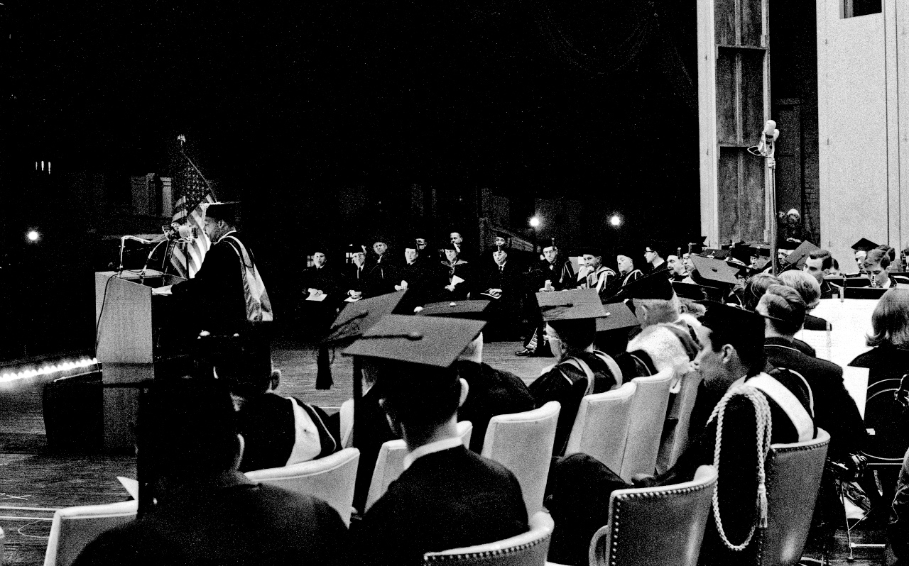

# Equality of opportunity at City College

{ width=75% }

# "Harvard of the Poor" as myth

{ width=75% }

# A liberalism which is truly liberal

# The self-satisfying liberalism of City College

# Meritocratic immunity of racial liberalism

# Enduring legacy of racial liberalism

{ width=75% }
