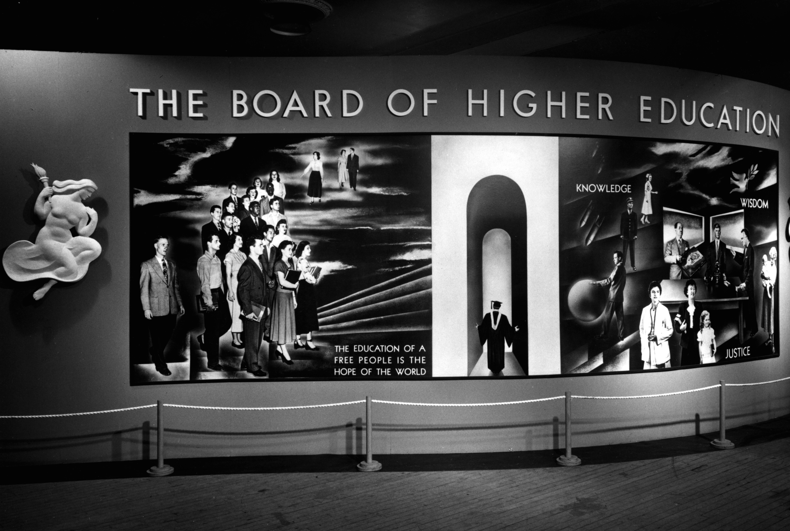
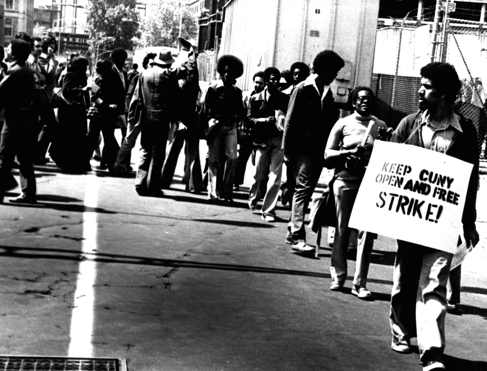

# Equality of opportunity at City College

> - Extending the benefits of education gratuitously
> - Open the doors to all

# "Harvard of the Poor" as myth

. . . 

> - Image originated with admission policy changes in the 1920s
> - Never adequate tax money
> - Effectively rationed free higher education
> - No longer "the children of pants pressers and pushcart peddlers"

# A liberalism which is truly liberal

> - MLK at City College on June 12, 1963.
> - Critical juncture in the Southern civil rights struggle
> - The "sunlight of reason" expressed in Kennedy's speech
> - The "sullen cloud" of the murder of Medger Evers
> - King: "de facto segregation of the north is as injurious to the Negro"

# The self-satisfying liberalism of City College

. . . 

> Many of them sat on platforms with all the imposing regalia of office to
> welcome me to their cities, and showered praise on the heroism of Southern
> Negroes. Yet when the issues were joined concerning local conditions only the
> language was polite; the rejection was firm and unequivocal. (MLK, 1965)

. . .

City College President Buell Gallagher was a prototypical Northern liberal

# Meritocratic immunity of racial liberalism

> - Meritocratic ideals immunized CUNY to charges of racial discrimination
> - Keep admission requirements higher for the few tuition-free seats in the day session
> - Add tuition-charging seats in the less selective evening sessions and community
colleges
> - Black students only 3.6 percent of total tuition-free enrollment
> - 60 percent of Black students enrolled as tuition-paying
> - A double penalty: excluded *and* subsidizing free tuition for others

# Enduring legacy of racial liberalism

> - CUNY doubled down in the 1960s on the meritocratic ideals that had created racial disparities
> - Earlier reform efforts reveal how the ideal of liberal meritocracy was a barrier to racial justice
> - Hunter student: "That City College is situated in a Negro area does not entitle Negroes to admission any more than the location of Cooper Union in the Bowery entitles derelicts to admission"
> - "New York City's education is infinitely better... but of what good is a superior education to a racial group or one of its members against whom college entrance doors are barred."
> - It was "criminal that a college so close, a college originally designed for poor people, has not opened its doors to them"
> - Students renamed the "Harvard of the Poor" as "The University of Harlem"
