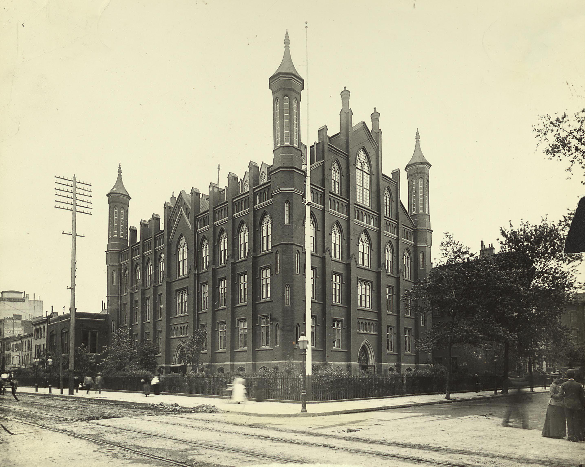
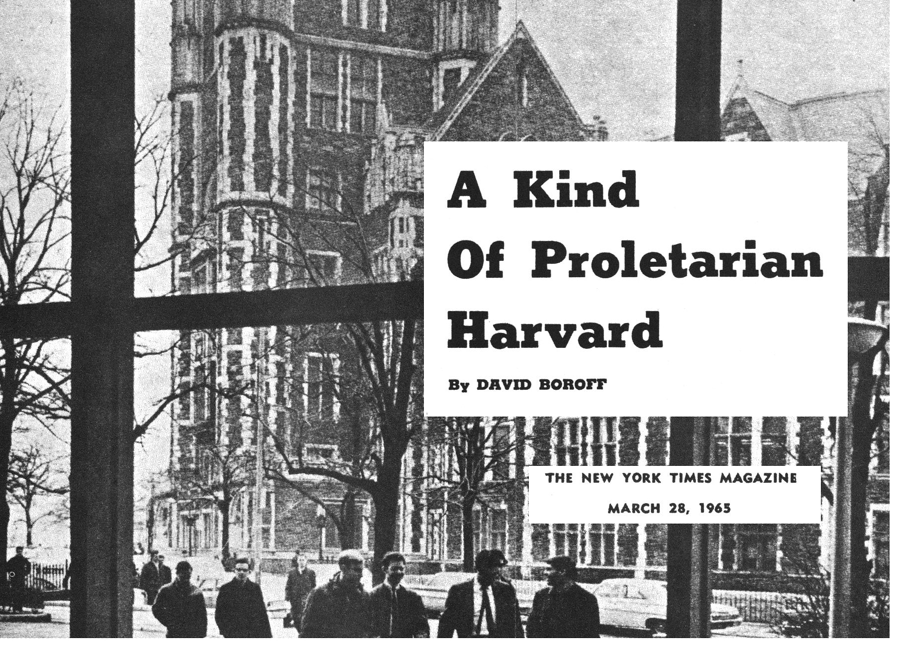
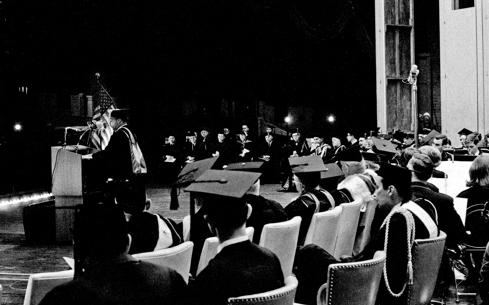
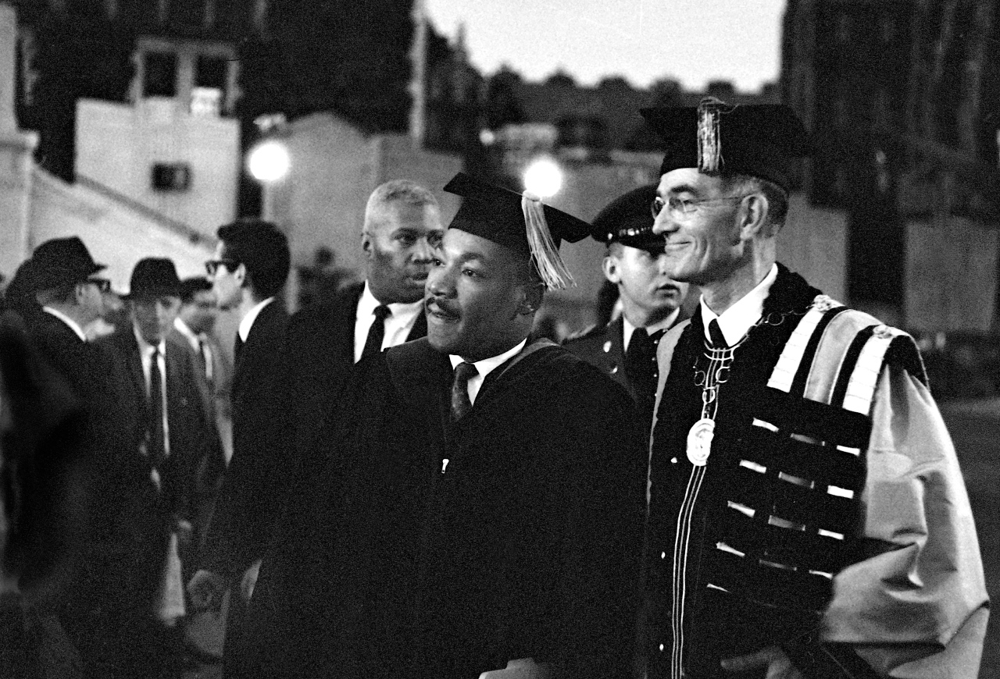
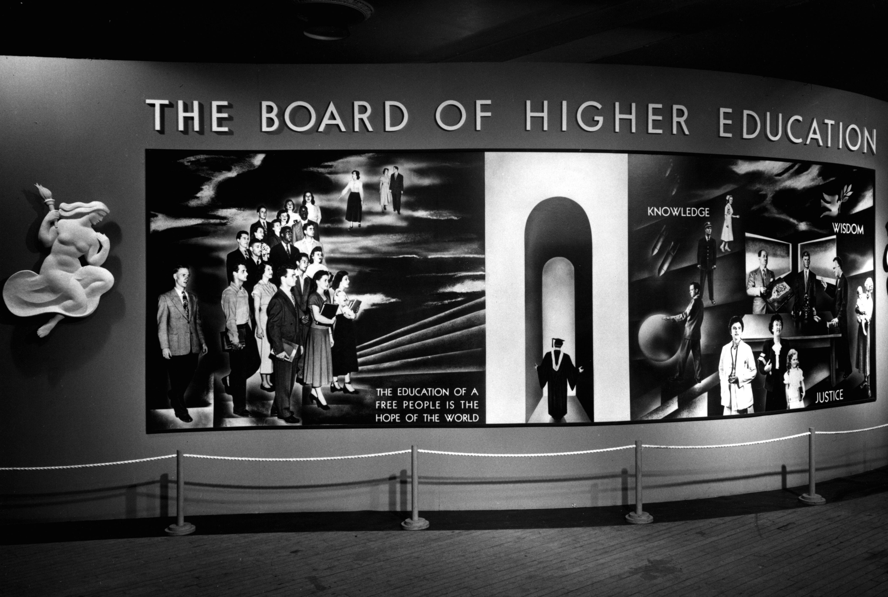
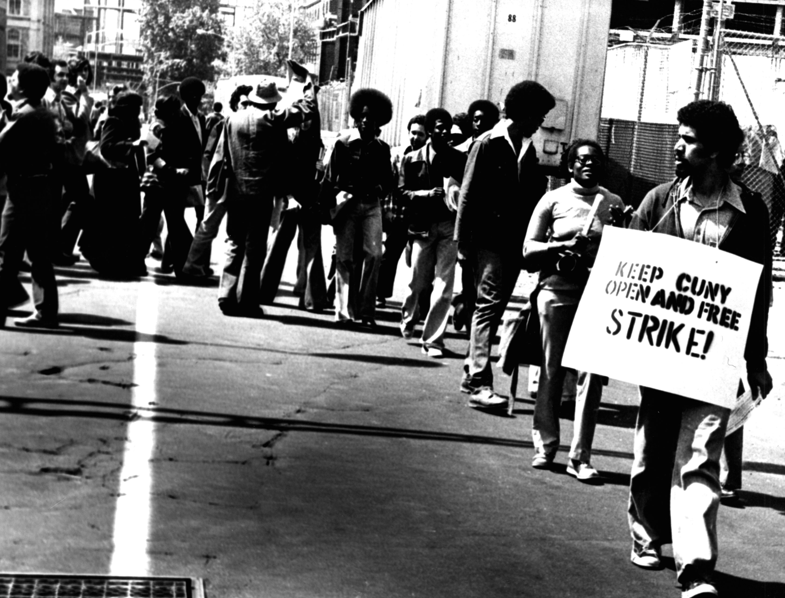

From its founding in the 19th century, City College has been associated with
an egalitarian and democratic mission. That mission was best reflected in its
reputation as the "Harvard of the Poor". And, central to that mission was the
fact that New York City's municipal colleges had maintained a policy of free
tuition for over 150 years until the fiscal crisis that crippled the city in
the 1970s. However, for fifty years before the policy was finally terminated,
City College enrolled a growing number of tuition-paying students. As
tuition-free education became a privilege for the few, admission requirements
become more selective. Therefore, by the 1960s, the "Harvard of the Poor" had
become more myth than mission. 

This myth took on a racial dimension because of the shifts in the city's
demographics after the Second World War. As a million white residents
migrated out and as many black Southerners along with Puerto Ricans migrated
in, the city's public schools were transformed. But the admission policies of
the municipal colleges effectively excluded these two social groups. In the
context of sharpening racial conflict, particularly around segregated
education, the absence of black students from the City University of New York
became a cause for concern, among the social groups excluded as well as
university administrators. However, rather than countenance even minor
reforms, defenders of the status quo, both inside and outside the university,
offered the mission and ideals of City College as justification for why the
college had, and could, remain predominantly white.

# Equality of opportunity at City College

City College of New York is 170 years old today. It's predecessor, the Free
Academy, was created in 1847, by a public referendum in which 85 percent of
the city's voters approved the creation of a tax-supported public academy.
The Free Academy, as stated in the original act, was created for "**the
purpose of extending the benefits of education gratuitously to persons who
have been pupils in the common schools**." Gratuitous, in this sense, was
meant as free of charge.

The President of the Board of Education at the time, who had proposed the
Free Academy, famously proclaimed "**Open the doors to all--let the children
of the rich and the poor take their seats together, and know of no
distinction save that of industry, good conduct, and intellect**." City
College, which would be new name of the Free Academy once it began granting
bachelor degrees in 1866, was founded with the mission of equal opportunity
grounded in egalitarian and democratic ideals unique at that time. But, as
this proclamation also made explicit, this mission would only extend to those
students who could demonstrate qualification: equal opportunity, but for
only those who deserved it.

For its first fifty years, when few aspired to education past primary
education, the limits of opportunity at City College were not yet readily
apparent. But, as demand grew, admission policies increasingly focused on
individual merit in order to select only the best qualified. Based on a
narrow construction of merit as high school grades and standardized test
scores, allocating a scarce tuition-free education effectively became virtue
of the system rather than a departure from its egalitarian and democratic
mission. Fundamentally, the meritocracy that emerged in the twentieth century
was legitimated as leveling the playing field since each individual would be
admitted on their demonstrated intellectual ability rather than social
traits. While color-blind by definition, meritocracy proved a racial myth
since it was used to evade how racism continued to make the playing field far
from level.

# "Harvard of the Poor" as myth

The reputation of City College as the "Harvard of the Poor" **originated from
policy changes starting in the 1920s**. In 1924, a required high school
average was introduced for gaining admission to city college. This was
necessary because the number of city students qualified for admission to City
College, and seeking higher education, had increased. Especially for the
children of Jewish immigrants from Eastern Europe who arrived at the turn of
the century, City College's meritocratic admission policies opened
opportunity otherwise closed off by the discriminatory practices of employers
and private colleges, like Columbia.

**Though begun as tuition-free, there was never adequate tax money to provide
enough of it for the city's public colleges**. **Increasing grade requirements
at City College effectively rationed free higher education.** As admission
requirements continued to climb, the rationing that had originally been an
unfortunate necessity because of business opposition to tax increases, became a
virtue of the college. In effect, the free public higher education in New York
City was transformed from a universal public good into tuition-free scholarships
for the most deserving.

In 1961, the loosely-coordinated four municipal colleges were consolidated into
one citywide system, the City University of New York (CUNY). By then, though,
these colleges were no longer for the city's poor. In a special New York Times
feature on CUNY published in 1965, David Boroff, a graduate of Brooklyn College,
noted that "the students themselves have unquestionably changed." They were no
longer "**the children of pants pressers and pushcart peddlers**." Instead, the
students at CUNY had come to be viewed as an academically elite whose families
could afford to pay tuition. Indeed, admission requirements had been rising
throughout the 1950s and would continue to do so in the 1960s, hittting record
levels as the children of the postwar baby boom graduated high school.

One of the main victims of rising admission requirements in the postwar period
were the city's Black population who were, more than ever, trapped in inferior
segregated schools. As nearly a million white residents left New York City after
the Second World War, an equal number of black Southerners and Puerto Ricans
migrated to the city, looking for jobs and educational opportunity. Yet, while
these two groups grew to half of the city's public school population, they
accounted for less than 5 percent of the tuition-free students at City College.

# A liberalism which is truly liberal

It is against this backdrop, we turn our attention to a speech that Martin
Luther King Jr. gave **at City College on June 12, 1963**. An estimated 15,000
people were gathered that day for commencement ceremonies. Even with such a
large audience, King had not yet gained the prominence as a national leader he
would after the March on Washington later that summer. In fact, the *New York
Times* only briefly remarked on the special speaker at commencement and no
mention of his speech made it into the page of the *Amsterdam News.*

King's appearance came at a **critical juncture in the Southern civil rights
struggle**. King received the invitation to speak at commencement the previous
month when he was helping lead a desegregation campaign in Birmingham, Alabama.
The night before commencement, President John F. Kennedy had delivered a speech
on live television to introduce federal civil rights legislation. Indeed,
Kennedy had begun the speech by addressing threats of violence following federal
desegregation efforts at the University of Alabama. And, tragically, on the
morning of commencement day, Medgar Evers, the NAACP field secretary in
Mississippi, was assassinated in front of his home. In his speech to City
College graduates later that day, King captured the turbulence of the moment by
contrasting **the "sunlight of reason" expressed in Kennedy's speech** to **the
"sullen cloud" of the murder of Medger Evers**.

Though attention was directed southward, for King, racial injustice was not a
problem unique to the South. King had already spoken of a "pressing need" for
"**a liberalism in the North which is truly liberal, a liberalism that firmly
believes in integration in its own community as well as in the deep South**." At
commencement, King echoed that message, calling upon the graduates to "see that
the **de facto segregation of the north is as injurious to the Negro student as
the legal segregation of the south**."

However, the absence of Black graduates at the City College commencement tells
us much about the Northern liberal version of Jim Crow to which King was
addressing. If you go through the yearbook from that graduating class, you'll
find fewer than 36 black graduates among the 2,800 bachelor degrees granted, or
less than 2 percent. Though the *New York Times* was quick to note the number of
graduates was the highest it had been since 1950, it failed to mention that the
total number of Black graduates had not changed over the intervening fifteen
years.

# The self-satisfying liberalism of City College

The image of King at commencement, in traditional academic regalia, foreshadows
his words two years later, after a summer of urban rebellions, when he
admonished Northern liberals:

> **Many of them sat on platforms with all the imposing regalia of office to
> welcome me to their cities, and showered praise on the heroism of Southern
> Negroes. Yet when the issues were joined concerning local conditions only the
> language was polite; the rejection was firm and unequivocal.**

The City College President Buell Gallagher, pictured here with King, had
extended the invitation to the Southern leader. Before City College, Gallagher
had been the president a historically black private college in Alabama. He had
also been elected to the board of directors of the NAACP in 1943 and served on
the that board for 30 years.

Gallagher was a **protypical Northern liberal**, the sort that King had spoken
of time and time again. His self-satisifed smile in this photograph from
commencement belies the limits of the City College version of Northern racism.
The college embraced a Southern civil rights leader even as it could turned away
many of the black students down the hill in Harlem. They rallied the audience to
the cause of civil rights even as they applauded a predominantly white
graduating class in a city that had close a million black residents.

# Meritocratic immunity of racial liberalism

The **meritocratic ideals immunized CUNY to charges of racial discrimination**.
Administrators and politicians could always point to the color-blind
meritocratic admissions requirements. But, being blind to the race of the
student, meritocracy, in fact, served to justify the racial inequality it
produced.

In 1959, the Board of Higher Education, the local governing body of the
municipal colleges, convened a special committee to propose policies for the
soon-to-be-named CUNY system. The committee found that demographic changes in
the city's public school, more of whom were graduating high school with lower
grades, would mean fewer of the city's students would be able to meet the high
admission requirements. Rather than countenance even minor reforms, it warned
against lowering admission requirements since it would only lead to a greater
number of students vying for seats in already crowded classrooms. Instead, the
committee's recommendation to the Board was to **keep admission requirements
higher for the few tuition-free seats in the day session**  and to **add
tuition-charging seats in the less selective evening sessions and community
colleges**.

The stratification within CUNY that developed proved injurious to the city's
black students. We know the full extent of their exclusion from tuition-free
CUNY only because of a federal decree that forced CUNY administration to conduct
its first demographic survey in 1967. The findings were especially damning.
**Black students were only 3.6 percent of the total matriculated enrollment at
the more selective four-year colleges**. Black students were more likely to be
enrolled in the less selective two-year community colleges, where they accounted
for 13 percent. Most significantly, **60 percent of all Black students enrolled
at CUNY were never admitted under existing admission requirements and were
instead paying tuition as non-matriculants**.

Indeed, the structure of racial inequality imposed **a double penalty** on black
students. High admission requirements meant that nearly all black students
educated in the city's segregated schools were excluded from the benefits of a
social provision their families paid taxes towards. Furthermore, those few black
students that did enroll at CUNY more often than not paid tuition. Therefore
black students disproportionately bore the additional burden of financing
tuition-free education for matriculated students in the day session.

# Enduring legacy of racial liberalism

Instead of redressing its growing racial problem, **CUNY doubled down in the
1960s on the meritocratic ideals that had created racial disparities**. Indeed,
the endurance of racial inequality at CUNY over the course of the decade is the
context for student protests led by black and Puerto Rican across the CUNY
campuses in 1969. When several hundred students occupied the South Campus of
City College on April 21, 1969, they precipitated a political crisis that
finally lowered admissions requirements and opened admissions to CUNY to all of
the city's high school graduates. The Open Admissions policy quickly transformed
the municipal system, increasing freshmen enrollments by 75 percent in one year.

But, looking to the failure of **earlier efforts to reform** CUNY's admissions
reveals how meritocracy had been a barrier to racial equality. In December 1963,
at a meeting of the City College faculty union, a recently appointed member of
the Board of Higher Education, the Black trade unionist Benjamin F. McLaurin,
called for reforming CUNY's admissions to increase the number of Black students.
He proposed that five to ten percent of the freshman class every year be
admitted not based on high school grades but instead on potential. These
students would be nominated by high school principals for admission to the
municipal colleges even though they had not met minimum grade requirements for
admission. Though color-blind by definition, McLaurin hoped that the city's
racial and ethnic minorities would disproportionately benefit from the policy.

However, even a reform, such as the one McLaurin had proposed, that remained
committed to meritocratic ideals was quickly shot down. In a letter published in
the *New York Times*, the chairman of the Board of Higher Education evaded the
racial problem entirely by denying the problem even existed. He retorted that
CUNY, in fact, had the largest percentage of Black and Puerto Rican
undergraduates of any university in the country. In another letter published in
the *Times* a few days later, a Hunter College student went so far as to
criticize the premise of McLaurin's proposal: "**That City College is situated
in a Negro area does not entitle Negroes to admission any more than the location
of Cooper Union in the Bowery entitles derelicts to admission**."

These responses to even minor reform illustrate the limits of racial equality
under the existing system. A 1964 report to the State senate had concluded that
a comparison of CUNY to the Jim Crow South was "bitterly ironic." Though the
Black population of New York City was approximately the same as it was in all of
Louisiana, the report estimated the more selective, tuition-free senior colleges
enrolled only 1,000 Black students whereas Louisiana's state colleges enrolled
more than 10,000. **"New York City's education is infinitely better," the report
admitted, "but of what good is a superior education to a racial group or one of
its members against whom college entrance doors are barred."**

In a 1968 essay, Addison Gayle, a City College instructor and noted critic on
black literature, wrote it was "**criminal that a college so close, a college
originally designed for poor people, has not opened its doors to them**". Those
doors finally opened once black and Puerto Rican students occupied City College
in April 1969. During their occupation, these students shed the myth of City
College as the "Harvard of the Poor" when they **renamed it "The University of
Harlem"**.

The meritocratic ideal lives on, even though tuition-free CUNY has long past,
and remains a barrier for achieving equality in our racially segregated
educational system.
